# Jaime Pineda

Software Developer specializing in JavaScript and TypeScript with a strong interest in full-stack development. Passionate about building high-quality applications, solving complex problems, and continuously learning new technologies. Currently expanding expertise in Java Spring Boot.

  

